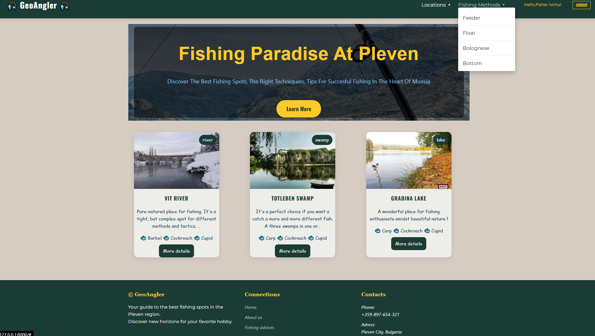
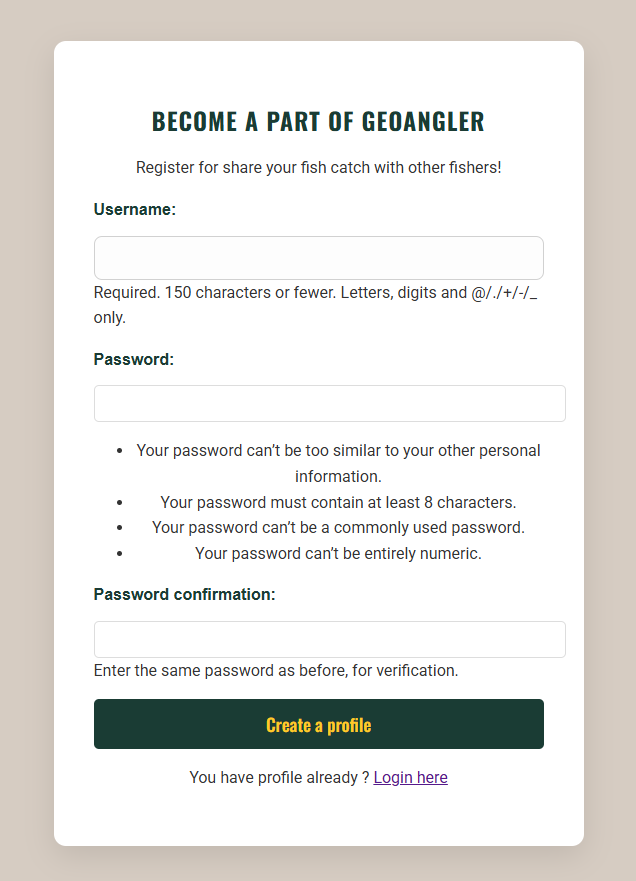
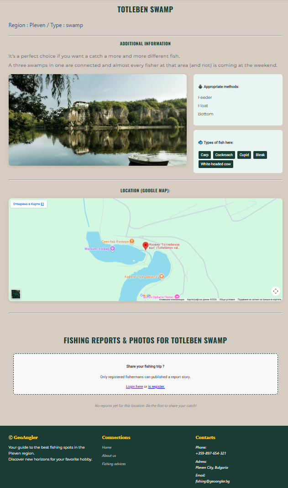
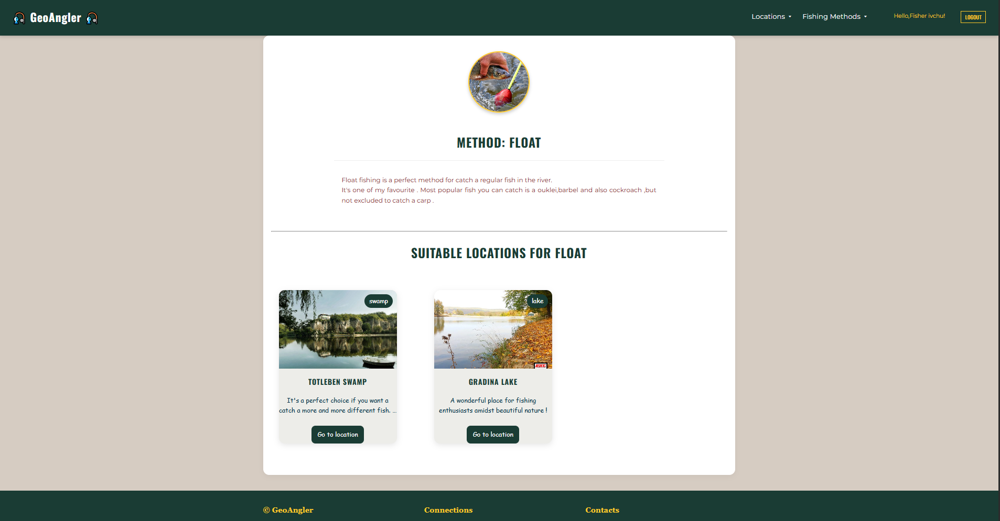
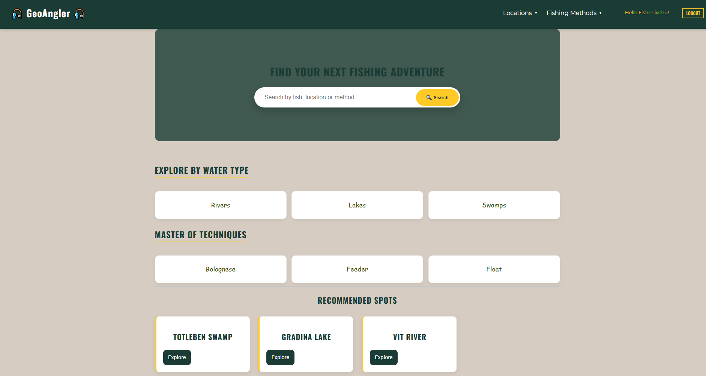
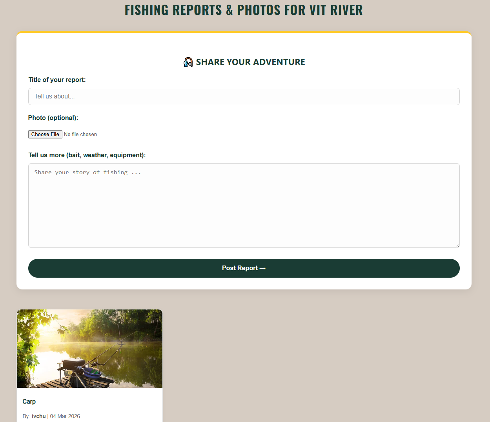

# GeoAngler Pleven

### A Full-Stack Geospatial Directory for Anglers in Pleven Region, Bulgaria

***GeoAngler***  is a robust web platform that centralizes angling intelligence for the Pleven region.
It bridges the gap between static location data and dynamic user needs through a custom-built filtering system and Google Maps integration.


## Key Technical Features

- ***Filtering Engine*** :  Leverages Django's ORM to filter locations by criteria (water body, type, fishing methods) using optimized `ManyToMany` queries.
- ***Relational Data Structure*** :  Link fishing reports (Posts) to specific locations using Django `ForeignKey`.
- ***Geospatial Integration*** :  Embedded ***Google Maps API*** for precise location tracking.
- ***Secure Configuration*** :  ***Implemented*** industry-standard security by decoupling settings from credentials using Environment Variables.
- ***SEO*** :  Responsive design (Flexbox/Grid) with optimized typography (Google Fonts).
- ***Discovery System*** :  ***Integrated*** a "Discover" module with intelligent filtering by water body, categories and fishing techniques.
- ***Smart Search*** :  ***Implemented*** a robust search engine using ***Django Q*** objects to perform Locations and Fishing Methods.
- ***Enhanced UX Interaction*** :  ***Developed*** a custom JavaScript dropdown navigation with smart hover-delay logic to prevent accidental menu closures.


## Preview

#### Interactive Landing Page (Parallax & Custom Navigation)


#### Secure Authentication (User Onboarding & Security Hints)


#### Detailed Spot Overview (Google Maps & Related Techniques)


#### Technique Encyclopedia (Related Locations & Data Mapping)


#### Complex Filtering & Search Results


#### Secure Community Feedback (User Reports)



## Tech Stack

- ***Backend*** :  Python , Django 
- ***Database*** :  PostgreSQL
- ***Frontend*** :  HTML, CSS ( Flexbox and Grid ), JavaScript (Custom Interactive Components)
- ***Environment Management*** :  Python-dotenv for secure credential handling.
- ***API*** :  Google Maps API


## What I Learned

- ***API Integration*** :  Gained experience in integrating and customizing third-party services like the Google Maps API for real-world applications.
- ***Querying*** :  Using a Django's `filter()` and `exclude()` methods to ***handle*** complex many-to-many relationships in a user-friendly way.
- ***Environment Security*** :  ***Learned the importance of securing sensitive data*** (API keys, DB credentials) using `python-dotenv` to follow ***industry best practices***.
- **Data Modeling** :  ***Understood how to design a relational schema*** that connects geographical locations with user-contributed reports and fishing methods.
- ***Query Logic*** :  Use a Django Q objects for complex OR statements, allowing users to search across multiple database models from a single input.
- ***UI Patterns*** :  ***Implemented*** hover logic in CSS and ***timeout-delay in JavaScript*** to create stable navigation menus.
- ***Filtering via URL*** :  ***Learned*** how to use request.GET to filter database results dynamically, without creating multiple redundant views.


## Instructions to setup

- Clone or download the repository :
- ```bash
- git clone https://github.com/Ivailo-Iliev-89/GeoAngler-Pleven.git
- ***Create*** a .env file and populate it with your DB credentials (see settings.py for required keys)
- pip install -r requirements.txt
- python manage.py makemigrations 
- python manage.py migrate
- python manage.py createsuperuser
- python manage.py runserver


##  Usage
  
- ***Explore Locations*** :  ***Navigate*** through the curated database of fishing spots in the Pleven region.
- ***Geospatial Navigation*** :  Click on the embedded Google Maps links to ***get precise GPS directions*** to each spot.
- ***Filter by Method*** :  Use the ***dynamic filter buttons*** to find spots suitable for specific techniques like "Spinning" or "Feeder".
- ***Manage Content*** :  Access the Django Admin panel to add new locations, update photos, or manage fishing reports.
- ***Smart Search*** :  Use the ***global search bar*** to find spots by name, description, or specific fish species and methods.
- ***Interactive Discovery*** :  Use the "Discover" dashboard to ***quickly jump into categories*** like Rivers, Lakes, or specialized techniques.


## Future Improvements

- ***Integration***  with a ***Weather API*** for real-time fishing conditions.
- ***Interactive***  "Catch Map" using ***Leaflet.js***.

